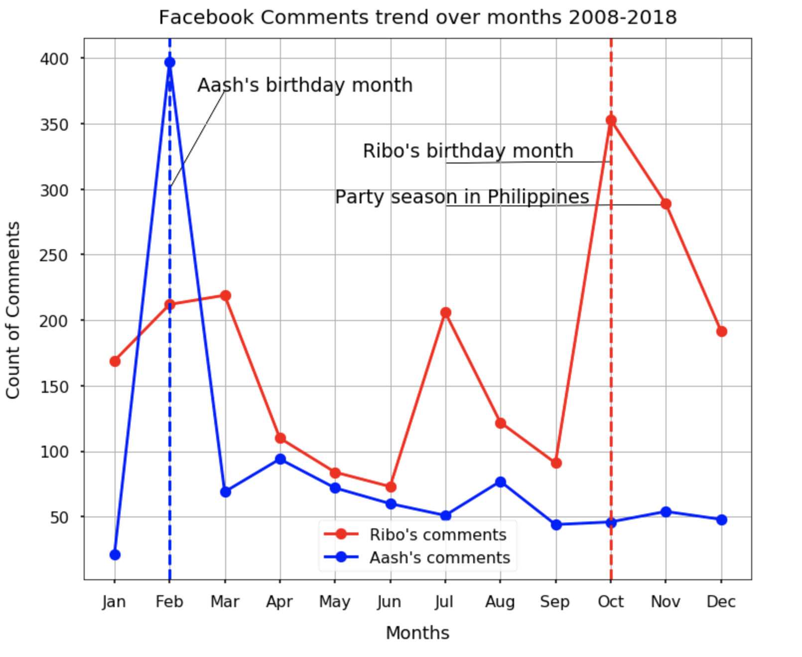
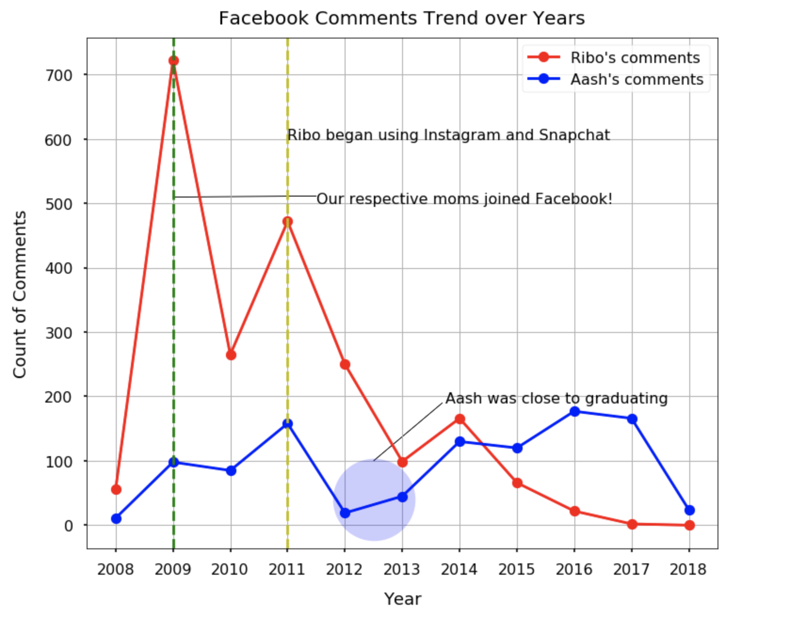
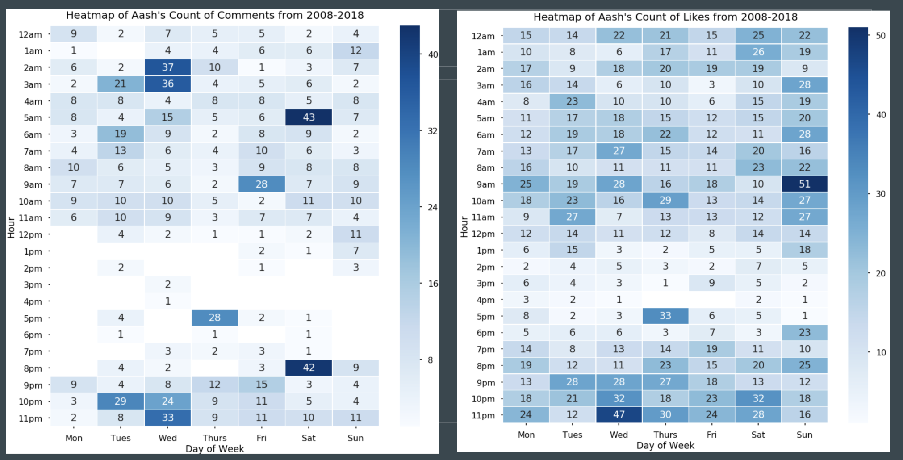
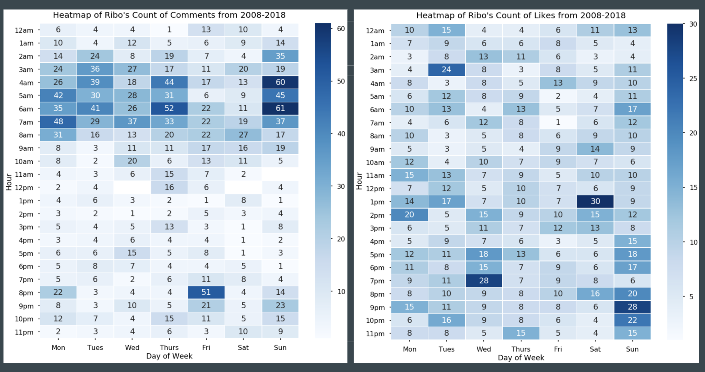

# Facebook_Data_Viz

#### Authors: Aashka Aradhya and Rico Rey Holganza
As of the first quarter of 2018, Facebook had 2.19 billion monthly active users!!
So this trend got us curious if we can analyze and compare how two different individuals use Facebook. We extracted data from our own Facebook profiles and analyzed the same to find some interesting insights.

#### This project has interactive plotly graphs which are not visible on Github. To view the notebook with interactive graphs, check out the link: http://nbviewer.jupyter.org/github/prismray/Facebook_Data_Viz/blob/master/Facebook_Analysis_Ribo_Aash.ipynb

## **This project has used data extracted from the profiles of :**

**1. Ribo :** A 23-year old full-time Supply Chain Management & Analytics graduate student and program manager at Santa Clara University aspiring to work in the mountain bike industry. :)

**2. Aash:** A 24-year old aspiring data scientist who is an Economics graduate from Mumbai,India currently pursuing MS in Information Systems from Santa Clara University

## **The steps involved in execution of this project include:**

### **1. Data extraction:** 
In the Facebook settings for your account — right below the link to deactivate it — there’s an option to download a copy of all your Facebook data. All those years of browsing the News Feed, and sharing selfies, engagements and birthday wishes on Facebook have taught the company quite a lot about us. We, the users, are part of the reason that Facebook has become so good at targeting ads. Here's the link to download all your data: https://www.facebook.com/settings. You have the option to download the data in HTML or JSON format. We chose to download our data in JSON as we can easily parse it using Pandas in Python.

### **2. Data:** 
The downloaded zip folder has different folders containing different kinds of information about our Facebook activities such as Ads, Comments, Likes and reactions, messages, search history, friends etcetra

### **3. Data cleaning** 
As mentioned, we downloaded our data in JSON and the cleaning process involved preparing the data for analysis by parsing it from JSON format to dataframes

### **4. Hypothesis** 
We tested the following Hypotheses:

**A.1** Hypothesis for Ribo's messages: Conversations with ex-girlfriends will vary greatly in terms of word choice and sentiment

**A.2** Hypothesis for Ribo's messages: Conversations with his friend are more likely to contain expletives and action words compared to messages with ex-girlfriends

**A.3** Hypothesis for Aash's messages: Conversations with high-school friends vary from conversations with university friends

**B.1** There will be a spike in commenting activity during one's birthday.

**B.2** There will be a reduction in Facebook usage either after parents joined or after introduction of competing social media platforms

**C.1** Both Aash and Ribo are more likely to "comment" on photos versus replies to comments and videos

**D.1** Both Aash and Ribo are more likely to "comment" and "like" on the weekends or after 5pm.

**E.1** Although Aash and Ribo are from different countires with diverse backgrounds, they will still have some common advertisers.

### **5. Testing:** 
(We have only added images for B, D and E to give an indicative view of our project. For all the visualizations and code, refer the Jupyter notebook attached in the repo or the nbviewer link: http://nbviewer.jupyter.org/github/prismray/Facebook_Data_Viz/blob/master/Facebook_Analysis_Ribo_Aash.ipynb) 

To test the above Hypotheses we visualized the following:

**A.** Comparative word visualizations of messages

**Insights:** 
* It can be inferred that Hypothesis A.1 and A.2 is correct as Ribo generally has the same conversations across all his ex-girlfriends. However, his conversations with his friend are a little more exciting because they contain expletive words, banter and indicate conversations around social activity with words like "go", "party", "drunk", "drink" etcetra
* It can be inferred that Hypothesis A.3 is correct as with Aash's High-School friend a lot of Hindi profane slangs and expletives can be observed as it is characteristic of the dialect spoken in Northern India, which is where she went to boarding school. Also it is interesting that most of her Facebook messages are from after she graduated high school and were exchanged when she was away from her high-school friends and so a lot of the words like 'missed' could be occuring often as they we reminiscing. Meanwhile her University friend lived really close to where she lived and so most conversations would revolve around plans and about the present which explains high occurence of the words 'now', 'go','get','time','today','got'

**B.** Visualizing and comparing most active months and years on Facebook by analyzing comments activity

**Insights:** It can be inferred from the graph above that Hypothesis B.1 is correct as, in both our cases we are most active in our Birthday Months but in Ribo's case he was also active in the month on November as it is the party season in Philippines

**Insights:** Hypothesis B.2 is true for Ribo as his activity significantly dropped after his mom joined Facebook but it's not too true for Aash as her activity has only significantly dropped in the 2012-2013 period when she was close to graduation and probably busy with studies. Ribo's activity also dropped when he switched to other social media platforms like Instagram and Snapchat but Aash is not too active on other social media platforms and her activity remained unaffected by emergence of other platforms

**C.** We can comment on photos, videos, posts or reply to others comments. We were curious to find out if we are more likely to comment on photos, videos, posts or reply to others comments. So the third visualization is an area chart of Ribo and Aash comments activity over time.

**Insights:**
* It can be inferred from the graph above that Hypotheses C.1 does not hold true for Aash as while her comments on Photos are higher than replies to other comments which are higher than comments on videos generally but comments on Posts are the highest for her especially in her Birthday month (Feb)
* It can be inferred from the graphs above that Hypotheses C.1 does not hold true for Ribo also as while his comments on Photos are higher than replies to other comments which are higher than comments on videos but it can also be seen that comments on Posts are higher than everything else generally

**D.** Heat Map representing the most active time and day of the week on Facebook, in terms of likes and comments for Aash and Ribo

**Insights:** From the above two heatmaps it can be inferred that Hypothesis D.1 is not entirely correct for Aash, as while she comments most on Saturdays from 5am-6am and from from 8pm-9pm and "likes" most on Sundays from 9am-10am. This also suggests that she comments on Saturdays and then when friends reply to those comment she likes them on Sunday mornings. However, she also actively comments on Tuesday nights/ early Wednesday morningns 2am-4am suggesting she most likely comments on Facebook not just on weekends but around middle of the week as well.

**Insights:** From the above two heatmaps it can be inferred that Hypothesis D.1 is correct for Ribo, as he comments most on Sundays from 4am-7am and likes the most on Sunday from 8pm to 11pm. This additionally suggests that he comments first and when friends reply to his comments, he "likes" their replies

**E.** The data also has a list of advertisers who have added our information to their list. Given our distinct backgrounds, we were curious to see if we have any common advertisers and so we visualized the same with a venn diagram wordcloud

**Insights:** From the Venn diagram wordcloud above, it can be inferred that Hypothesis E.1 is correct as Ribo and Aash do have many common advertisers such as Quora, Turbotax, Juul, Netflix, Dell, Chobani, Airbnb etcetra
